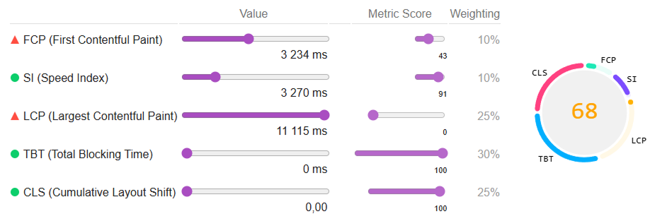
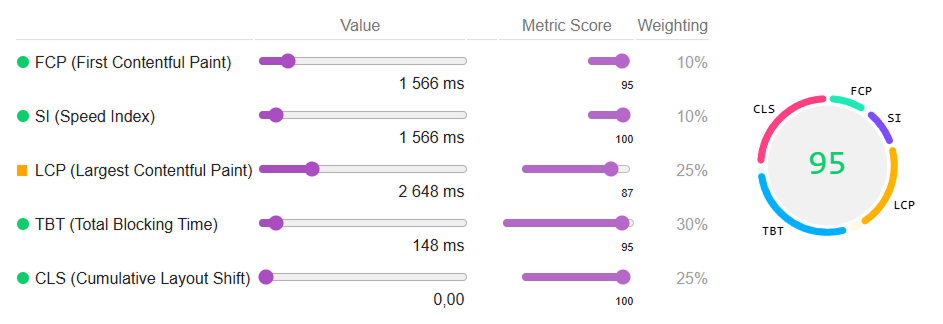

# IG Launch — Corporate Landing Page

A dark-themed corporate landing page for **IG Launch**, focused on a structured content layout, responsive UI, and performance-oriented front-end implementation.

🔗 [**Live Demo**](https://ig-launch.spekter.solutions)  

---

## Project Overview

This project presents a multi-section corporate website with:
- Hero promo section with animated background and floating elements
- Ticker-style partner logos block
- Educational section explaining **ICOs vs IPOs**
- Timeline-style sections (ICO / IPO stages)
- Principles / steps section
- Investment history slider with card-based layout

The layout is designed to be readable, consistent, and easy to navigate across devices.

---

## Key Focus Areas

- **Responsive layout** (desktop / tablet / mobile)
- **Semantic HTML structure** for sections and headings
- **Accessibility-friendly patterns** (ARIA labels, decorative elements hidden from AT, keyboard-safe buttons)
- **SEO-friendly structure** (clean headings, section naming, meaningful content blocks)
- **Performance focus** (explicit image sizing, lazy-loading for non-critical visuals)
- **Modular CSS classes** (component-like structure)

---

## Tech Stack

- **HTML5** — semantic, standards-compliant markup
- **CSS3 / SCSS** — responsive layout, animations, media queries
- **JavaScript (Vanilla)** — lightweight UI interactions
- **WebP / WebM** — optimized image delivery
- **Lighthouse-driven optimization** — performance, accessibility, SEO

---

## Project Structure

```  
public/
├── assets/
│   ├── css/
│   ├── img/
│   ├── js/
│   └── scss/
│
├── templates/
├── index.html
├── robots.txt
└── site.webmanifest

```

---

## Accessibility Notes

This project follows practical a11y improvements, including:
- Named sections (`aria-labelledby`) where visual headings aren’t present
- Decorative UI elements marked as `aria-hidden="true"`
- Icon-only controls provided with accessible names (`aria-label`)
- Images include appropriate `alt` (or empty `alt` when decorative)

---

## SEO Notes

- Clean content hierarchy (section headings and card titles)
- Metadata supported: **title**, **description**, **keywords**
- Layout built with crawl-friendly HTML (no critical content injected only via JS)

---

## Performance Notes

If you are auditing with Lighthouse:
- Ensure non-critical images use `loading="lazy"` and `decoding="async"`
- Avoid delaying the hero’s LCP element via heavy paint effects or late-loading fonts
- Prefer `font-display: swap` for custom fonts

---

## Lighthouse Performance

Performance optimization was carried out as part of the front-end delivery process.

---

## 📊 Lighthouse Metrics — Before → After Optimization Main Page

| Metric            | Before                                   | After                                    | Improvement |
|-------------------|-------------------------------------------|-------------------------------------------|-------------|
| **Performance**   |   |   | ↑ +23        |
| **Accessibility** |  |  | ↑ +25       |
| **Best Practices**|  |  | —          |
| **SEO**           |  |  | —         |


### 🖼 Before / After 

|  |  |
|:--:|:--:|
| **Before** | **After** |

---

### 🎯 JSON reports
- [Before JSON](./media/index-before.json)
- [After JSON](./media/index-after.json)